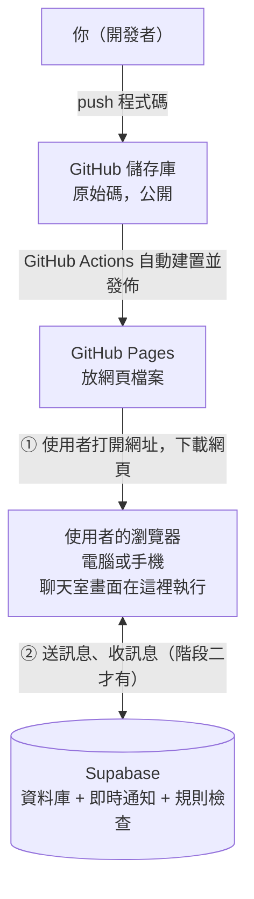

# 匿名聊天室 架構文件

這份文件寫給不寫程式的人看。專有名詞第一次出現時，會用一句話解釋。文件裡沒有程式碼，只說明這個聊天室怎麼組成、為什麼這樣做、做完要怎麼驗收。

需求的原始版本在 `docs/requirements.md`。這份文件把它和後來逐題確認的行為整合在一起。

---

## 1. 專案說明與目標

### 這是什麼

一個不用登入的匿名聊天室。所有人都在同一個聊天室裡，沒有分頻道。知道網址的人，用電腦或手機都可以進來。

### 使用者會看到什麼、做什麼

| 項目 | 行為 |
|---|---|
| 進入 | 打開網頁，輸入一個代號（暱稱），進入聊天室。 |
| 代號規則 | 1～12 個字。中文、英文、數字、emoji 都可以。前後的空白會自動去掉。英文大小寫視為相同（`Amy` 和 `amy` 算同一個）。 |
| 代號不能重複 | 代號有人在線上使用時，不能進入，畫面提示換一個。同一個人開第二個分頁也一樣被擋。對方離線後，代號就能再被使用。 |
| 再次進入 | 重新整理或隔天再來，輸入框會先填好上次的代號，按確認才進入。 |
| 訊息內容 | 只能傳純文字，上限 500 字。網址不會變成可點的連結。 |
| 送出訊息 | 電腦：按 Enter 送出，Shift+Enter 換行。手機：Enter 是換行，旁邊有送出按鈕。 |
| 訊息外觀 | 顯示代號、內容、時:分。同一個人連續發的訊息合併，只在第一則顯示代號。每個代號有固定的顏色。自己的訊息靠右，別人的靠左。跨日時加一條日期分隔線。 |
| 歷史訊息 | 新人進來時看到最近 50 則。系統只保留最近 200 則，畫面上會註明。 |
| 誰在線上 | 電腦：側邊欄一直顯示線上名單。手機：頂端顯示「N 人在線」，點了才展開名單。自己的名字標示「（你）」。 |
| 進出提示 | 有人進來或離開時，訊息之間插入一行灰色小字，並留在歷史裡。網路短暫中斷、30 秒內又連回來的，不顯示。 |
| 離開 | 有「離開」按鈕，按了立刻釋出代號。 |
| 斷線 | 頂端顯示「連線中斷，重新連線中…」。輸入框暫時鎖住，但已經打的字保留。連回來後自動補上漏掉的訊息。 |
| 外觀 | 酒紅色 `#9F0050` 當主色，淡黃色 `#FFE66F` 點綴，底色白或淺灰，參考東華大學企管系網站的配色。深色模式跟隨使用者手機或電腦的設定。 |

### 目標

1. 先把前端做好，放上 GitHub Pages，任何人打開網址就看得到。
2. 最後才接上 Supabase，變成真的多人即時聊天。
3. 接上 Supabase 時，畫面程式不用重寫。

---

## 2. 整體架構圖

先解釋三個名詞：

- **瀏覽器**：使用者用來看網頁的軟體，例如 Chrome、Safari。
- **GitHub Pages**：GitHub 提供的免費網頁空間。把網頁檔案放上去，別人用網址就能打開。它只負責「放檔案」，不會執行任何後端程式。
- **Supabase**：一個雲端服務，提供資料庫（存資料的地方）和即時通知功能。聊天室的訊息、線上名單都放在這裡。



重點：

- **沒有自己架的伺服器**。GitHub Pages 只放檔案，Supabase 負責所有「需要記住、需要通知大家」的事。
- **瀏覽器之間不會直接對話**。A 送出訊息 → 到 Supabase → Supabase 通知所有在線的瀏覽器。
- **階段一時，上圖的第②步不存在**。瀏覽器只跟 GitHub Pages 要網頁，之後的一切都在瀏覽器裡面用假資料模擬。

---

## 3. 技術選擇

每一項都寫「選了什麼」和「為什麼」。

### 3.1 前端語言：TypeScript

- **前端**：使用者在瀏覽器裡看到、點到的部分。
- **選了什麼**：TypeScript。它是 JavaScript（瀏覽器唯一能直接執行的程式語言）的加強版，會在寫程式時就檢查資料格式對不對。
- **為什麼**：聊天室裡有很多固定格式的資料（訊息、線上名單），格式一旦寫錯，只有在實際執行時才會發現問題。TypeScript 在寫的時候就會提醒，減少出錯。

### 3.2 前端框架：React，搭配 Vite

- **框架**：一套別人寫好的工具，規定了畫面程式要怎麼組織，讓你不用從零開始。
- **選了什麼**：React（負責畫面）和 Vite（負責把程式整理成可以放上網的檔案）。
- **為什麼**：
  - 聊天室畫面有好幾個會「自己更新」的區塊：訊息列表、線上名單、連線狀態。React 把畫面拆成一個個小零件，資料變了，對應的零件自動更新。
  - Vite 整理出來的是純靜態檔案（只有網頁、不需要伺服器），剛好適合放 GitHub Pages。
  - React 與 TypeScript 的資料與教學都很多，之後找資料或請人協助比較容易。

### 3.3 後端：Supabase 的資料庫與即時通知

用到 Supabase 的三個功能：

| 功能 | 一句話解釋 | 在聊天室裡的用途 |
|---|---|---|
| **Postgres 資料庫** | 一個存放資料的表格系統。 | 存訊息、存目前在線的人。 |
| **Realtime（即時通知）** | 資料庫有新增或刪除時，立刻通知所有連線中的瀏覽器。底層用 WebSocket：一條保持連著的網路線，不用每次重新問「有新訊息嗎」。 | 有人送訊息、有人進來或離開時，所有人立刻看到。 |
| **資料庫函式（RPC）** | 寫在資料庫裡的一小段規則，前端只能「呼叫」它，不能直接改資料。 | 進入、送訊息、離開、心跳都透過它，由它檢查規則。 |

**為什麼用這個組合**：訊息和線上名單本來就要存進資料庫（給新人看歷史、判斷代號是否重複）。資料一寫進去，Realtime 就順便通知所有人，一套機制同時解決「存」和「推」。

### 3.4 這一版不用的做法，以及原因

| 沒選的做法 | 為什麼不選 |
|---|---|
| Supabase 的「Presence」（內建的線上名單功能） | 它不保證代號不重複，也沒辦法在伺服器端記錄「某人離開了」。 |
| Supabase 的「Broadcast」（只轉發、不存） | 訊息還是要存起來給新人看歷史，這樣會變成兩套機制。 |
| Supabase 的登入功能（含「匿名登入」） | 你的需求是不用登入。匿名登入雖然使用者看不到登入畫面，但 Supabase 對每個網路出口（IP）有註冊次數限制，學校或公司同一個出口的人一多，可能有人進不來。這個聊天室也不需要帳號概念。 |

### 3.5 其他工具

- **GitHub Actions**：GitHub 提供的自動化功能。你把程式 push 上去，它會自動整理並發佈到 GitHub Pages。
- **pg_cron**：Supabase 資料庫裡的定時工作功能。這裡用來每 10 秒檢查「誰已經超過 30 秒沒有回報」，把他們視為離開。是否支援每 10 秒執行，要在你的 Supabase 專案上實測，方法在第 13 節。

---

## 4. 兩個階段

### 設計重點：中間隔一層「後端介面」

前端的畫面程式不直接跟 Supabase 說話，而是跟一個「後端介面」說話。這個介面規定了畫面可以要求什麼（進入、送訊息、離開…）、會收到什麼通知（新訊息、名單更新、連線狀態）。

後端介面背後有兩種實作：

- **假後端**：階段一使用，全部在瀏覽器裡模擬。
- **Supabase 後端**：階段二使用，真的連到 Supabase。

這就像牆上的插座：插座的孔位（介面）不變，背後接的電是假的還是真的，電器（畫面）不需要知道。所以階段二只需要新增「Supabase 後端」，再把畫面使用的後端從假的換成真的，**畫面程式不用重寫**。

### 階段一：還沒接 Supabase

**前端要能做到什麼程度**

畫面和互動全部完成，包含：

- 輸入代號、代號規則檢查、「已被使用」提示。
- 聊天室畫面：訊息列表、輸入與送出、線上名單、進出提示、日期分隔線、「N 人在線」。
- 手機與電腦兩種版面，淺色與深色模式。
- 斷線提示（階段一用手動切換開關來模擬，例如在畫面上提供一個只在開發階段出現的「模擬斷線」按鈕）。
- 離開按鈕、記住上次代號。

**假後端怎麼運作**

- 資料都存在瀏覽器裡，重新整理後不保證保留。
- 同一台電腦、同一個瀏覽器開多個分頁，分頁之間可以互相收到訊息與看到彼此上線（用瀏覽器內建的分頁之間傳話功能 `BroadcastChannel`）。
- 為了讓只有一個人打開網址時，畫面也不是空的，假後端會放幾個「示範用的假成員」，偶爾自動說一句話。這些假成員的代號會固定標明是示範（例如「示範-小花」），階段二就移除。

**怎麼在 GitHub Pages 上看到效果**

1. 程式 push 到 GitHub 的 `main` 分支。
2. GitHub Actions 自動整理並發佈。
3. 打開 `https://samsonchen.github.io/anonymous-chat-macos/`，就能看到完整畫面。
4. 手機和電腦都直接開這個網址測試。

**階段一的限制，要讓看的人知道**

- 不同人、不同裝置之間，**看不到彼此**。只有你自己同一個瀏覽器開多個分頁才互通。
- 所以階段一的網址適合「看畫面、試操作」，不適合真的拿來聊天。

### 階段二：接上 Supabase 之後的改變

| 項目 | 階段一 | 階段二 |
|---|---|---|
| 訊息與名單存在哪 | 瀏覽器裡 | Supabase 資料庫 |
| 誰能互相看到 | 同一個瀏覽器的不同分頁 | 全世界所有開網址的人 |
| 示範假成員 | 有 | 移除 |
| 代號重複判斷 | 只在同一個瀏覽器內 | 由資料庫統一判斷 |
| 離開提示（直接關掉分頁） | 用計時器模擬 | 由資料庫每 10 秒清掃一次 |
| 訊息保留 | 不保證 | 最近 200 則 |
| 需要新增的設定 | 無 | Supabase 專案、資料表與函式、兩把金鑰（第 8 節） |

**需要修改與不需要修改的**

- 新增：Supabase 後端（一個新的檔案）、資料庫的建立指令、金鑰設定、GitHub 的變數設定。
- 修改：決定使用哪個後端的那一行設定。
- 不修改：所有畫面、元件、版面、代號規則檢查、顏色規則。

---

## 5. 通訊約定

這一節定義前端和後端之間「說什麼話」。階段一的假後端和階段二的 Supabase 後端，都必須遵守同一份約定。

### 5.1 資料格式

**訊息（Message）**

| 欄位 | 內容 | 說明 |
|---|---|---|
| `id` | 數字 | 資料庫自動編號，越新越大。斷線補訊息時用它判斷「我最後收到哪一則」。 |
| `kind` | `chat`、`join`、`leave` 三選一 | 一般訊息、有人進來、有人離開。 |
| `nickname` | 文字 | 發言者或進出者的代號（保留原本的大小寫）。 |
| `body` | 文字或空 | 訊息內容。進出提示沒有內容，是空的。一般訊息 1～500 字。 |
| `created_at` | 時間 | 由資料庫在存進去時記錄，不是使用者的手機時間。 |

**成員（Member）**

| 欄位 | 內容 | 說明 |
|---|---|---|
| `nickname_key` | 文字 | 代號去掉前後空白、轉成小寫後的版本。用來判斷是否重複。 |
| `nickname` | 文字 | 畫面上顯示的代號（保留原本的大小寫）。 |
| `joined_at` | 時間 | 進入聊天室的時間。 |

**成員的暗碼與心跳（對前端不公開）**

| 欄位 | 內容 | 說明 |
|---|---|---|
| `nickname_key` | 文字 | 對應到成員。 |
| `tab_secret` | 隨機文字 | 每個分頁自己產生的暗碼，下面會說明。 |
| `last_seen` | 時間 | 最後一次回報「我還在」的時間。 |

這一份資料另外存放，因為即時通知會把一筆資料的全部欄位推給所有人，暗碼不能放在會被推給大家的資料裡。

### 5.2 前端對後端說的話（指令）

| 指令 | 傳什麼 | 結果 |
|---|---|---|
| `join_room`（進入） | 代號、這個分頁的暗碼 | 成功，或失敗並說明原因：`taken`（已被使用）、`invalid`（格式不符）、`unavailable`（連不上，畫面顯示「目前無法連線」） |
| `send_message`（送訊息） | 代號、暗碼、內容 | 成功，或失敗：`not_member`（你已不在線上）、`empty`（空白）、`too_long`（超過 500 字）、`unavailable`（連不上） |
| `heartbeat`（心跳） | 代號、暗碼 | 每 10 秒呼叫一次，告訴資料庫「我還在」。 |
| `leave_room`（離開） | 代號、暗碼 | 立刻離開並釋出代號。 |
| `load_recent`（讀最近訊息） | 要幾則 | 回傳最近的訊息，進入時要 50 則。 |
| `load_since`（補漏掉的訊息） | 最後一則的 `id` | 回傳 `id` 比它大的所有訊息，斷線重連時用。 |
| `load_members`（讀名單） | 無 | 回傳目前所有在線成員。 |

### 5.3 後端通知前端的事件

| 事件名稱 | 什麼時候發生 | 帶什麼資料 |
|---|---|---|
| `message_received` | 有新的訊息（包含進出提示）寫進資料庫 | 一則訊息 |
| `member_joined` | 有人加入線上名單 | 一個成員 |
| `member_left` | 有人從線上名單移除 | 該成員的 `nickname_key` |
| `connection_changed` | 連線狀態改變 | `online`（正常）或 `reconnecting`（重新連線中） |
| `session_lost` | 已經加入的人，因為斷線太久而失去資格（代號被別人用掉） | 原因：`taken` 或 `not_member`。畫面收到後回到輸入代號畫面，並顯示說明原因的提示。 |

在 Supabase 裡，前三種事件對應的是資料表的「新增」與「刪除」通知。`connection_changed` 是前端偵測到網路線斷掉或接回來時自己產生；`session_lost` 是重新連線後重新加入（`join_room`）被回覆 `taken` 時產生。

（`session_lost` 與 `unavailable` 是階段一實作畫面時補上的，原本的約定沒有列。）

### 5.4 分頁暗碼（為什麼需要）

需求裡有兩條互相衝突的規則：

1. 代號不能重複，同一個人開第二個分頁也要擋。
2. 重新整理頁面時，不能被「自己剛剛的連線」擋住。

解決辦法：每個分頁在被打開時，自己產生一組隨機字串當暗碼，存在瀏覽器的「分頁暫存」（`sessionStorage`）。這個暫存的特性是：重新整理時還在，但另開分頁就是全新的。

- 重新整理：暗碼相同 → 資料庫認得是同一個人，直接讓他回去，也不產生進出提示。
- 另開分頁、另一台裝置：暗碼不同 → 擋下來，顯示「這個代號已經有人用了」。
- 直接關掉分頁：沒有人再回報心跳，30 秒後被清掃，代號釋出。

已知的小缺陷：瀏覽器的「複製分頁」功能會連暫存一起複製，複製出來的分頁會被當成同一個人。這個情況很少見，這一版接受。

### 5.5 資料庫自己執行的規則

- **進入時**：先清掉超過 30 秒沒有心跳的人；再看代號是否被使用（依 5.4 的規則）；沒被使用就加入名單並寫一則 `join` 訊息。
- **送訊息時**：發言者的代號由資料庫從成員資料查出來，不採用前端傳來的代號，所以沒辦法冒用別人的名字發言。
- **每 10 秒清掃一次**：超過 30 秒沒有心跳的人，移出名單，並各寫一則 `leave` 訊息。
- **訊息超過 200 則時**：新訊息寫入後，自動刪除最舊的，只留最新 200 則。

---

## 6. 資料流

### 6.1 進入聊天室

1. 使用者打開網頁，看到輸入代號畫面。輸入框填入上次用的代號（如果有）。
2. 使用者按確認。前端先檢查格式（長度、不是空白、沒有看不見的字元）。不符就在畫面上提示，不送出。
3. 前端產生（或沿用這個分頁已有的）暗碼，呼叫 `join_room`。
4. 資料庫判斷：
   - 代號沒人用 → 加入名單，寫入 `join` 訊息，回傳成功。
   - 代號有人用，暗碼相同 → 視為重新整理，回傳成功，不產生提示。
   - 代號有人用，暗碼不同 → 回傳 `taken`，畫面顯示「這個代號已經有人用了，請換一個」。
5. 成功後，前端依序：先開始監聽事件，再讀最近 50 則訊息和目前名單。（先監聽再讀取，是為了避免兩步之間剛好有新訊息而漏掉。）
6. 前端把代號存起來（下次預先填入），開始每 10 秒送一次心跳，顯示聊天室畫面。
7. 其他在線的人會收到 `member_joined` 與一則「某某加入了聊天室」。

### 6.2 送出訊息

1. 使用者輸入文字，按送出（電腦 Enter、手機送出按鈕）。
2. 前端檢查：去掉前後空白後不是空的、不超過 500 字。不符就不送出。
3. 呼叫 `send_message`。
4. 資料庫確認這個人確實在線上（暗碼正確）、內容符合規則，寫入訊息。
5. 所有在線的人（包含發言者自己）收到 `message_received`，畫面顯示新訊息。
   - 發言者自己的畫面也是等收到這個事件才顯示，不先顯示再補。這樣畫面上看到的永遠是資料庫確實收下的結果。
6. 送出失敗（例如 `not_member`）：輸入框保留文字，畫面提示原因。

### 6.3 離開

**主動離開（按離開按鈕）**

1. 使用者按「離開」。
2. 呼叫 `leave_room`，資料庫立刻把他移出名單、寫一則 `leave` 訊息。
3. 前端停止心跳，回到輸入代號畫面。代號立刻可被別人使用。

**被動離開（直接關掉分頁、手機沒電、網路斷了很久）**

1. 沒有人再送心跳。
2. 超過 30 秒後，資料庫的每 10 秒清掃把他移出名單，寫一則 `leave` 訊息。
3. 其他人收到 `member_left`，名單更新，並看到「某某離開了聊天室」。
4. 代號此時才可被別人使用。

### 6.4 斷線重連

1. 前端偵測到連線中斷（網路線斷掉）：
   - 頂端顯示「連線中斷，重新連線中…」。
   - 輸入框鎖住，已打的字保留。
2. 前端自動嘗試重新連線。
3. 連回來後：
   - **30 秒內連回**：用同一組暗碼呼叫 `join_room`，資料庫認得是同一個人，不產生進出提示。接著呼叫 `load_since` 補上漏掉的訊息，並重新讀名單。提示消失，輸入框解鎖。
   - **超過 30 秒才連回**：此時他已被清掃離開。`join_room` 會重新加入，產生一則加入提示，再補訊息。
   - **代號在這段時間被別人用掉**：回到輸入代號畫面，說明「連線中斷太久，代號已被他人使用，請重新輸入」。
4. 手機把網頁切到背景再切回來時，計時器可能暫停。所以每次網頁回到前景，要立刻送一次心跳並檢查連線，不要等下一個 10 秒。

---

## 7. 畫面清單

這一節只說每個畫面有什麼元素、各自的行為。顏色、字型、間距、版面細節由 `/design` 決定。

### 畫面 A：輸入代號畫面

| 元素 | 行為 |
|---|---|
| 聊天室名稱與簡短說明 | 純顯示。名稱與文字由設計階段決定。 |
| 代號輸入框 | 預先填入上次使用的代號。輸入時即時提示格式問題（太長、全空白、含看不見的字元）。 |
| 「進入」按鈕 | 格式不符時無法按。按下後進入「處理中」狀態，防止連按。 |
| 錯誤提示 | 顯示「這個代號已經有人用了，請換一個」，或其他失敗原因。使用者修改輸入後提示消失。 |
| 回來提示 | 如果是因為斷線太久被送回這個畫面，顯示說明原因的一行文字。 |
| 無法連線提示（階段二） | 連不上 Supabase 時顯示「目前無法連線，請稍後再試」，不讓使用者卡在轉圈。 |

### 畫面 B：聊天室畫面

| 元素 | 行為 |
|---|---|
| 頂端列 | 顯示聊天室名稱、「目前 N 人在線」、「離開」按鈕。手機上點「N 人在線」會展開線上名單。 |
| 連線狀態提示 | 斷線時出現「連線中斷，重新連線中…」，連回後消失。 |
| 訊息區 | 由舊到新排列。新訊息出現時，如果使用者本來就在最底部，自動捲到最底；如果使用者正在往上看舊訊息，不自動捲動，改顯示「有新訊息」的按鈕，點了回到最底。 |
| 一般訊息 | 顯示代號、內容、時:分。同一人連續發言合併，只在第一則顯示代號。自己的靠右，別人的靠左。每個代號依名字固定一種顏色。 |
| 進出提示 | 一行灰色小字，置中，例如「小明 加入了聊天室」。 |
| 日期分隔線 | 兩則相鄰訊息跨日時，中間加一條日期。 |
| 保留說明 | 訊息區最上方一行小字：「只保留最近的 200 則訊息」。 |
| 線上名單 | 列出所有在線的人，自己標示「（你）」。電腦在側邊欄一直顯示；手機預設收起，點頂端的人數才展開，再點一次或點外面就關閉。 |
| 輸入框 | 多行文字輸入。電腦：Enter 送出、Shift+Enter 換行。手機：Enter 換行。顯示字數，接近或超過 500 字時提示。斷線時鎖住但保留文字。 |
| 送出按鈕 | 手機必有；電腦也有。輸入框為空或超過字數時無法按。 |

### 畫面 C：特殊狀態

| 狀態 | 畫面 |
|---|---|
| 被擋下（代號重複） | 留在畫面 A，顯示錯誤提示。 |
| 斷線太久被移除 | 回到畫面 A，顯示說明原因的提示。 |
| 服務暫停或無法連線 | 畫面 A 或 B 顯示「目前無法連線」。階段二才會遇到。 |

---

## 8. 金鑰

**金鑰**：一串很長的文字，用來向 Supabase 證明「我是被允許連線的程式」。

這個專案只會用到 Supabase 給的兩種金鑰，另外加上專案網址：

| 項目 | 能做什麼 | 能不能公開 |
|---|---|---|
| **專案網址（Project URL）** | 告訴程式 Supabase 專案在哪裡。 | 可以公開。 |
| **公開金鑰（anon key 或 publishable key）** | 只能做 Supabase 資料庫規則允許的事：讀訊息和名單、呼叫進入／送訊息等函式。 | 可以公開。設計上就是要放進網頁，任何人打開網頁都能看到。 |
| **秘密金鑰（service_role key 或 secret key）** | 可以繞過所有規則，讀寫、刪除資料庫的一切。 | **絕對不能公開。** 這個專案用不到它，所以完全不要把它放進任何地方。 |

> Supabase 近期把金鑰名稱做了調整，新舊兩種名稱（anon / service_role 與 publishable / secret）可能同時出現在後台。意思是對應的：anon 就是 publishable，service_role 就是 secret。

### 為什麼公開金鑰可以公開

網頁的內容任何人都看得到，所以公開金鑰一定會被看到。安全性不靠「藏起金鑰」，而是靠資料庫端的規則：

- 資料表只開放「讀取」，不開放前端直接新增、修改、刪除。
- 所有寫入都要經過資料庫函式，由函式檢查規則。
- 暗碼存放的資料表，前端完全讀不到。

這套規則的名稱叫 **RLS（Row Level Security，資料列安全規則）**：由資料庫決定「誰可以對哪些資料做什麼」。

### 怎麼產生

1. 到 Supabase 網站註冊並建立一個專案（階段二才需要做）。
2. 進入專案後台 → Project Settings → API（或 API Keys）。
3. 複製「Project URL」和「anon / publishable key」。**不要複製 service_role / secret key。**

### 放在哪裡

| 情況 | 放哪裡 |
|---|---|
| 在自己電腦上開發 | 專案根目錄的 `.env.local` 檔案。這個檔案已列入忽略清單，不會被上傳到 GitHub。 |
| GitHub Pages 自動發佈時 | GitHub 儲存庫 → Settings → Secrets and variables → Actions → **Variables** 分頁，新增兩個同名變數。因為這兩個值本來就會出現在發佈的網頁裡，用 Variables 即可，不必用 Secrets。 |

### 怎麼避免被 commit 到 GitHub

**commit**：把檔案的變更正式記錄到 Git 的版本紀錄裡，push 之後就會出現在 GitHub 上。這個儲存庫是公開的，任何上傳的內容全世界都看得到，且刪掉後歷史紀錄還是找得到。

1. `.gitignore`（Git 的「不要追蹤」清單）要包含 `.env.local` 和所有 `.env*`（`.env.example` 除外）。
2. 另外提供 `.env.example`，只寫變數名稱、不寫實際的值，讓人知道要設定什麼。
3. commit 前看一下 `git status`，確認清單裡沒有 `.env.local`。
4. GitHub 的公開儲存庫可以開啟「Secret scanning」功能，偵測到常見的金鑰格式被推上去時會警告。請在儲存庫的 Settings 確認是否已啟用。
5. **萬一不小心把秘密金鑰推上去了**：不要只刪檔案。立刻到 Supabase 後台把那把金鑰重新產生（舊的就作廢），再處理 GitHub 上的紀錄。

---

## 9. 安全與限制

### 9.1 別人可能送進來的奇怪東西，以及怎麼擋

**原則**：前端的檢查只是第一道，用來給使用者即時回饋。有心人可以不透過我們的網頁，直接對 Supabase 送資料。所以**每一項規則，資料庫端也必須再檢查一次**，前端的檢查不能當作安全防線。

| 可能送來的東西 | 前端怎麼擋 | 資料庫端怎麼擋 |
|---|---|---|
| 超長訊息（幾萬字） | 輸入框顯示字數，超過 500 字不能送。 | 內容超過 500 字直接拒絕。 |
| 空白訊息、全是空白或換行 | 去掉前後空白後是空的，不能送。 | 同樣檢查，空的拒絕。 |
| 程式碼或網頁標籤，例如 `<script>…</script>`，企圖讓別人的瀏覽器執行它（這類攻擊叫 XSS） | 訊息一律當作「純文字」顯示，不當作網頁內容解讀。React 預設就是這樣處理文字，這一版**禁止使用會把文字當網頁內容的寫法**。 | 資料庫只存文字，不做解讀。 |
| 看不見的字元（零寬空格等），用來讓代號看起來是空白，或與別人的代號看起來一樣 | 代號去除這些字元後必須還有內容；含這類字元的代號拒絕。 | 同樣檢查。 |
| 長得很像的代號（例如 `Amy` 和 `Amγ`，後者是希臘字母） | 無法完全擋。這一版只處理英文大小寫相同。 | 同左。列為已知限制。 |
| 超長代號 | 超過 12 字不能送。 | 同樣檢查。 |
| 大量換行，讓一則訊息佔滿整個畫面 | 一則訊息的顯示高度限制，過長時收合。 | 不限制（字數上限已壓住）。 |
| 偽造別人的名字發言 | 前端不傳發言者名字。 | 發言者由資料庫依暗碼查出，不採用前端傳來的。 |
| 直接呼叫資料庫試圖改別人的資料、讀暗碼 | 無。 | 資料表只開放讀取；暗碼資料表完全不開放；所有寫入只能走函式。 |
| 重複送出同一個請求（手滑連按、腳本狂送） | 送出後按鈕暫時失效，防止連按。 | **這一版不限速**，見第 10 節。 |
| 用腳本把很多代號佔滿 | 無。 | 每個代號要持續送心跳才會保留；停止後 30 秒釋出。但在持續送心跳期間，別人用不了。列為已知風險。 |

### 9.2 匿名的意思

「匿名」是指其他使用者看不到你是誰。但 Supabase 和 GitHub 作為服務提供者，仍可能保有連線的網路位址（IP）等紀錄。不要在文件或畫面上宣稱「完全無法追查」。

### 9.3 免費方案的上限

以下數字來自 Supabase 官方文件（Realtime Limits 頁面）與官方說明，方案內容可能調整，建專案時請再看一次當時的說明。

| 限制 | 內容 | 對聊天室的影響 |
|---|---|---|
| 同時連線數 | 200 | 同時在線最多 200 人，第 201 個人連不上。 |
| 每秒訊息數 | 100 | 一般聊天不會碰到。 |
| 專案閒置暫停 | 一週內幾乎沒有人使用，專案會被暫停 | 暫停期間沒人能連。要到後台手動恢復，資料會保留。聊天室閒置一週後，下一個人會遇到連不上。 |
| 定時工作的最短間隔 | 官方文件沒有明確寫出，要實測 | 影響「離開」提示多久出現，詳見第 13 節。 |

---

## 10. 這一版刻意不做的事

| 不做 | 為什麼 |
|---|---|
| 註冊、登入 | 需求明確不要。 |
| 多個聊天室、頻道 | 需求是單一聊天室。資料表因此不需要「房間」欄位，結構簡單。 |
| 圖片、檔案、語音 | 需要另外的儲存空間與檢查機制，成本與風險都高。第一版只傳純文字。 |
| 網址自動變成連結 | 避免有人貼惡意連結讓人不小心點到。 |
| 發送速度限制 | 你決定第一版完全開放。已知風險：有人可以狂送訊息洗版。如果之後需要，在「送訊息」的資料庫函式裡加一個簡單的頻率檢查，不用改畫面。 |
| 管理者、踢人、刪訊息 | 需要「管理者身分」，等於要有登入，與「不用登入」衝突。 |
| 使用者自己刪除訊息 | 沒有帳號，無法確認訊息是誰發的，所以沒辦法讓人刪除自己的訊息。靠「只保留最近 200 則」自動清除。 |
| 私訊、已讀、正在輸入中 | 不在需求內，且會增加即時通知的流量。 |
| 訊息搜尋、無限往上捲的歷史 | 系統只保留 200 則，沒有搜尋的對象。 |
| 通知推播（網頁不開著也會響） | 需要額外的服務與使用者授權，不在這一版範圍。 |
| 網址分享預覽圖、多語系 | 非必要，先不做。 |

---

## 11. 儲存庫的資料夾結構

**儲存庫（repo）**：放這個專案所有檔案的地方，在 GitHub 上。

以下是結構。**階段一已經建好，只有標明「階段二才新增」的（`supabase.ts`、`supabase/`）還沒有。**

```
anonymous-chat-macos/
├── README.md                  專案簡介、怎麼在自己電腦上開起來
├── .gitignore                 不要上傳的檔案清單（含 .env.local）
├── .env.example               金鑰設定範本，只有名稱沒有實際的值
├── package.json               專案使用哪些工具的清單
├── vite.config.ts             整理網頁檔案時的設定（含 GitHub Pages 的路徑）
├── index.html                 網頁入口
│
├── docs/
│   ├── requirements.md        需求說明（已有）
│   ├── architecture.md        這份文件
│   └── design.md              畫面設計（顏色、尺寸、文字）
│
├── src/                       所有畫面與前端程式
│   ├── main.tsx               程式入口
│   ├── App.tsx                依狀態切換畫面 A（輸入代號）與畫面 B（聊天室）
│   ├── config.ts              各種數字（字數上限、心跳秒數…）集中在這裡
│   ├── text.ts                畫面上所有的文字集中在這裡
│   ├── backend/               「後端介面」與它的兩種實作
│   │   ├── types.ts           資料格式與介面的定義（第 5 節）
│   │   ├── mock.ts            假後端（階段一）
│   │   ├── mock.test.ts       假後端的自動測試
│   │   ├── supabase.ts        Supabase 後端（階段二才新增）
│   │   └── index.ts           決定目前使用哪一個後端
│   ├── hooks/
│   │   ├── useChatRoom.ts     聊天室的資料：訊息、名單、連線狀態
│   │   └── useMediaQuery.ts   判斷手機或電腦版面
│   ├── screens/
│   │   ├── JoinScreen.tsx     畫面 A
│   │   └── ChatScreen.tsx     畫面 B
│   ├── components/            畫面的小零件：頂端列、訊息列表、輸入框、線上名單、連線橫條、測試面板…
│   ├── lib/
│   │   ├── nickname.ts        代號與訊息的規則檢查
│   │   ├── color.ts           代號對應固定顏色
│   │   ├── chatItems.ts       把訊息整理成「日期線、提示、一組組發言」
│   │   ├── time.ts            時間與日期的顯示
│   │   └── storage.ts         瀏覽器儲存空間（含分頁暗碼）
│   └── styles/                tokens.css（顏色等變數，見 docs/design.md）與 app.css
│
├── supabase/
│   └── migrations/            資料庫的建立指令（階段二才新增）
│
└── .github/
    └── workflows/
        └── deploy.yml         自動整理並發佈到 GitHub Pages 的設定
```

---

## 12. 部署到 GitHub Pages 的方式

**部署**：把做好的網頁放到網路上，讓別人能用網址打開。

### 前提

- 儲存庫：`https://github.com/samsonchen/anonymous-chat-macos`，是公開的。GitHub Pages 在免費帳號下需要儲存庫是公開的，符合。
- 發佈後的網址：`https://samsonchen.github.io/anonymous-chat-macos/`。
- 因為網址最後多了一段 `/anonymous-chat-macos/`（不是網站的根目錄），整理網頁檔案時要告訴工具這個前綴，否則網頁會找不到自己的檔案而一片空白。這個設定放在 `vite.config.ts`。

### 流程

1. **一次性的設定**（開發者做一次）：
   - 在 GitHub 儲存庫的 Settings → Pages，把發佈來源（Source）選為 **GitHub Actions**。
   - 階段二才需要：在 Settings → Secrets and variables → Actions → Variables 加入兩個金鑰變數（第 8 節）。
2. **之後每次更新**：
   - 把程式 push 到 `main`。
   - GitHub Actions 自動：安裝需要的工具 → 整理網頁檔案 → 發佈到 GitHub Pages。
   - 約一到兩分鐘後，網址上的內容更新。
3. **出問題時**：到 GitHub 儲存庫的 Actions 分頁，可以看每次發佈的紀錄與錯誤訊息。

### 注意

- GitHub Pages 只放靜態檔案。Supabase 的資料庫設定不在這個流程裡，是另外在 Supabase 後台設定（階段二）。
- 網址是 https，手機與電腦都能直接開。

---

## 13. 驗證清單

每一項都要實際操作確認，通過才算完成。

### 階段一（還沒接 Supabase）

**畫面與操作**

- [ ] 電腦（Chrome）與手機（iPhone Safari、Android Chrome 至少各一）都能打開 GitHub Pages 網址，沒有空白畫面、沒有找不到檔案的錯誤。
- [ ] 輸入代號：1 字、12 字可以進入；13 字、全空白、含看不見字元的不能進入，並有提示。
- [ ] 代號前後有空白時，進入後顯示的是去掉空白的版本。
- [ ] 同一瀏覽器開兩個分頁：第二個分頁輸入同一個代號，被擋並顯示提示；輸入 `Amy` 與 `amy` 也被擋。
- [ ] 重新整理頁面：輸入框預先填入上次的代號，按確認後進入，不會被自己擋住。
- [ ] 送出訊息：電腦 Enter 送出、Shift+Enter 換行；手機 Enter 換行、按鈕送出。
- [ ] 空白訊息不能送；超過 500 字不能送，並有字數提示。
- [ ] 訊息顯示代號、時:分；同一人連續發言合併；自己靠右、別人靠左；每個代號顏色固定。
- [ ] 輸入 `<b>粗體</b>` 或 `<script>alert(1)</script>`，畫面上原樣顯示為文字，沒有被解讀。
- [ ] 網址（例如 `https://example.com`）顯示為純文字，不能點。
- [ ] 線上名單：電腦側邊欄、手機點開都正確；自己標示「（你）」；人數正確。
- [ ] 進出提示：另開分頁加入、離開，原分頁出現灰色提示。
- [ ] 按「離開」回到輸入畫面；之後可以用同一個代號重新進入。
- [ ] 模擬斷線：顯示重新連線提示、輸入框鎖住、已打的字保留；恢復後提示消失、輸入框解鎖。
- [ ] 訊息超過 200 則時，最舊的被移除，畫面上有保留說明。
- [ ] 往上捲看舊訊息時，來新訊息不會強制跳到最底；出現「有新訊息」按鈕。
- [ ] 淺色與深色模式（切換手機或電腦的系統設定）：文字都讀得清楚。
- [ ] 手機直向與橫向、不同螢幕寬度，版面都沒有被切掉、沒有左右捲動。
- [ ] 儲存庫裡沒有任何金鑰（階段一本來就沒有）。

**部署**

- [ ] push 到 `main` 後，GitHub Actions 自動成功發佈，沒有紅色錯誤。
- [ ] 網址更新後能看到最新內容。

### 階段二（接上 Supabase）

**設定與金鑰**

- [ ] 在 Supabase SQL Editor 實測 `pg_cron` 是否支援每 10 秒執行：
  1. Database → Extensions，啟用 `pg_cron`。
  2. 查版本，1.5 以上才支援「N seconds」。
  3. 建立一個每 10 秒執行的測試排程；回傳錯誤就是不支援。
  4. 等 1 分鐘，查執行紀錄，間隔約 10 秒就成功。
  5. 刪掉測試排程。
  - 不支援時，退回每分鐘執行；進出提示會晚到最多 1 分鐘，但代號重複判斷不受影響。
- [ ] 儲存庫（包含所有 commit 歷史）裡找不到秘密金鑰（service_role / secret）。
- [ ] `.env.local` 沒有出現在 `git status` 的待上傳清單裡。
- [ ] 公開金鑰與專案網址已設到 GitHub Variables，發佈後的網頁連得上 Supabase。

**基本功能（兩個以上不同的裝置，例如電腦加手機）**

- [ ] 兩台裝置互相看得到對方的訊息，延遲很短（約一兩秒內）。
- [ ] 兩台裝置互相出現在對方的線上名單，人數正確。
- [ ] 新裝置進入時，看到最近 50 則歷史訊息。
- [ ] 一台裝置使用某代號時，另一台裝置輸入同一個代號（含大小寫不同）被擋。
- [ ] 同一台電腦另開分頁輸入同一個代號被擋；重新整理原分頁不會被擋，也不產生進出提示。
- [ ] 按「離開」後，另一台裝置立刻看到離開提示，且該代號立刻可被使用。

**離開與斷線**

- [ ] 直接關掉分頁：約 30 秒內其他裝置看到離開提示、名單更新、代號釋出。
- [ ] 手機切到別的 App 5 秒再回來：沒有進出提示，訊息沒有漏。
- [ ] 開啟飛航模式 10 秒再關閉：顯示重新連線提示，連回後補上漏掉的訊息，輸入框中已打的字還在。
- [ ] 斷線超過 1 分鐘再連回：回到加入流程或重新加入，並有正確的說明。
- [ ] 斷線期間代號被他人用掉：回到輸入畫面並說明原因。

**資料與規則**

- [ ] 訊息超過 200 則時，資料庫只留最新 200 則。
- [ ] 超過 500 字的訊息，用網頁介面送不出去；用其他工具直接呼叫資料庫送也被拒絕。
- [ ] 嘗試直接用公開金鑰對資料表新增、修改、刪除，被拒絕。
- [ ] 嘗試用公開金鑰讀取存放暗碼的資料表，讀不到。
- [ ] 送訊息時偽造其他人的代號，無效（顯示的仍是自己的代號）。

**上限與例外**

- [ ] 在 Supabase 後台確認當時的免費方案限制（同時連線數、每秒訊息數），與第 9.3 節的數字一致；不一致就更新這份文件。
- [ ] Supabase 專案在暫停狀態下打開網頁，顯示「目前無法連線」，不是白畫面或無限轉圈。
- [ ] 手機與電腦、淺色與深色，整個流程都再走一遍。
